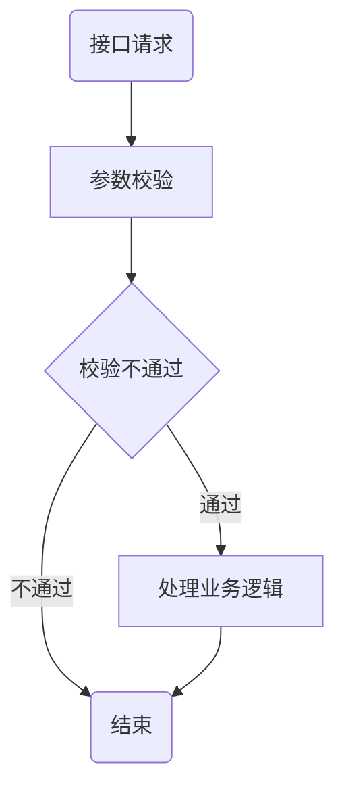

## getDerivedStateFromProps

## componentDidMount

## componentShouldUpdate

## getSnapshotBeforeUpdate

## componentDidUpdate

## componentWillUnmount

## 流程图

### 挂载

```mermaid
graph TB
    A(接口请求) --> B[参数校验]
    B[参数校验] --> C{校验通过?}
    C{校验通过?} -- 通过 --> d[处理业务逻辑]
    C{校验不通过} -- 不通过 --> e[结束]
    d[处理业务逻辑] --> e(结束)
```

### 更新